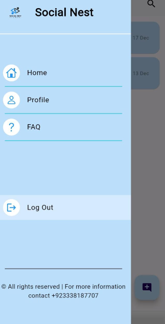

# Social Nest
This repository contains work originally developed in Oct-Nov 2023. The commits are dated according to the original work timeline, but the repository was created on 29th August, 2024 for organizational and archival purposes.

**Social Nest** is a dynamic social media application developed using Dart as a part of Mobile Application Development Course. This application allows users to **CHAT** with friends, share posts, and create personal TODOs. It utilizes Firebase Firestore for real-time data management. Users can enjoy **YouTube videos** directly within the app and stay updated with the latest **NEWS** from around the globe. Customize your experience with versatile **PROFILE** settings.

## Features

- **Chat**: Connect with friends and engage in real-time conversations.
- **Share Posts**: Post updates and share your thoughts with others.
- **TODOs**: Organize your tasks and set reminders.
- **YouTube Videos**: Watch videos using direct links.
- **News**: Get the latest news from around the world.
- **Profile Customization**: Personalize your profile to reflect your style.

## Screenshots

Here is a screenshot of the application in action:

